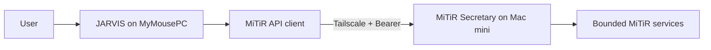

# Phase 1 Architecture — JARVIS to MiTiR Integration

## 1. System boundary

JARVIS owns user interaction, approval, client behavior, and result presentation. MiTiR owns specialist execution, task state, safety boundaries, and service availability.

## 2. Deployment view

| Component | Host | Address | Responsibility |
|---|---|---|---|
| JARVIS client | Windows `MyMousePC` | Tailscale client | Initiate and validate requests |
| MiTiR Secretary | Mac mini `ohidemac-mini` | `100.72.156.117:8080` | Serve API v0.1.0 |
| Preferred route | Tailscale MagicDNS | `ohidemac-mini.taild8cb51.ts.net:8080` | Private name-based connection |
| Fallback route | Tailscale IPv4 | `100.72.156.117:8080` | Used only if MagicDNS fails |

## 3. Security architecture

Two controls are required:

1. Network boundary: MiTiR listens only on its Tailscale address.
2. Application boundary: all endpoints except `/health` require the shared Bearer token.

The token is supplied at runtime through `MITIR_INTEGRATION_TOKEN`. It must never be represented in source, SDD documents, Git history, screenshots, logs, or test reports.

## 4. Request flow

1. JARVIS performs Tailscale and TCP preflight.
2. JARVIS calls public `/health` and verifies readiness/API version.
3. JARVIS adds `Authorization: Bearer <runtime token>` for authenticated calls.
4. JARVIS discovers current capabilities.
5. JARVIS submits `daily.summary` with a correlation ID and `Idempotency-Key`.
6. JARVIS polls the task with bounded attempts.
7. JARVIS verifies replay, conflict, and terminal cancellation semantics.
8. JARVIS emits redacted evidence for the cross-project handoff.

## 5. Failure classification

| Failure | Owner/action |
|---|---|
| Tailscale disconnected or host unresolved | User/JARVIS host preflight |
| TCP 8080 unreachable | MiTiR runtime or Tailscale binding check |
| `/health` not ready | MiTiR runtime check |
| HTTP 401 | Verify token configuration on both hosts without exposing value |
| Response model mismatch | Stop; compare actual response with OpenAPI and notify MiTiR |
| Task timeout | Capture task ID/correlation ID; do not retry indefinitely |
| HTTP 409 on exact replay | Contract violation; report to MiTiR |
| Secret found in output | Stop, remove evidence, rotate token if exposure occurred |

## 6. Change policy

- OpenAPI is the integration source of truth.
- Contract changes require document-first impact analysis.
- MiTiR internals remain opaque to JARVIS.
- The JARVIS client must not add undocumented assumptions about MiTiR.
- A real integration test is opt-in and must never run automatically without token/network prerequisites.

