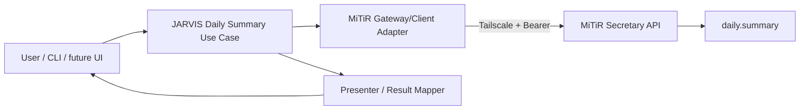

# Phase 2 Architecture — Operational Daily Summary

## 1. Intent

Phase 2 must convert the verified MiTiR integration into a reusable JARVIS application capability without coupling user-facing code to HTTP/task lifecycle details.

## 2. Target shape

The exact module/class names should follow the current JARVIS repository after inspection. This diagram defines responsibilities, not a mandatory folder rewrite.

## 3. Responsibilities

### User entry point

- accepts a simple user request/command;
- invokes the JARVIS application use case;
- prints/renders the JARVIS result;
- does not manage Bearer headers, polling, retries, or task JSON directly.

A narrow diagnostic option may expose only non-secret task ID, correlation ID, terminal state,
and completion time after the normal readable output. It must not expose task JSON, headers, or
runtime configuration values.

### Daily Summary use case

Owns the product workflow:

1. obtain runtime MiTiR configuration;
2. ask the MiTiR client/gateway for a `daily.summary` execution;
3. map the terminal result into a JARVIS-owned result model;
4. classify failures into stable JARVIS categories;
5. return readable data to the presenter.

### MiTiR client/gateway

Reuse the Phase 1 `MiTiRClient` and typed models. Any additional convenience operation should be a thin composition over existing API calls, not a second transport stack.

The gateway may encapsulate:

- health check;
- capability discovery when required;
- task creation;
- bounded polling;
- task result retrieval.

### Presenter/result mapper

Transforms the MiTiR domain-summary payload into a stable JARVIS representation. It should tolerate optional fields but must not invent missing facts.

## 4. Result model

Prefer a JARVIS-owned model containing only fields needed by product code, for example:

- status;
- reporting timestamp/date;
- headline/summary;
- important items;
- alerts/actions;
- source references;
- task ID/correlation ID as diagnostic metadata.

Do not leak the entire integration task record as the public application contract.

## 5. Configuration

Runtime inputs remain:

- `MITIR_BASE_URL`
- `MITIR_INTEGRATION_TOKEN`

Configuration loading belongs at the composition/entry-point boundary. Core result mapping and business/application logic should remain testable without environment variables.

## 6. Failure model

Map low-level failures into stable categories before the user-facing boundary:

- `configuration_error`
- `unreachable`
- `not_ready`
- `unauthorized`
- `capability_unavailable`
- `timeout`
- `task_failed`
- `contract_error`

Preserve a safe diagnostic message and references. Do not expose secrets or raw tracebacks by default.

## 7. Testing architecture

Use dependency injection/fake client or fake gateway for ordinary tests. Tests must cover transformation and failure mapping without a live network.

The real Windows→MiTiR path remains a separate opt-in acceptance test using the already verified runtime variables and Tailscale route.

## 8. Change discipline

- Do not modify MiTiR unless a real API defect is proven.
- Do not replace the Phase 1 client with ad-hoc requests.
- Do not add a generalized agent/plugin framework for this one use case.
- Prefer the smallest implementation that can later be called by a conversational JARVIS layer.
- If the current repository already contains a suitable application/service abstraction, extend it instead of forcing this document's example names.
