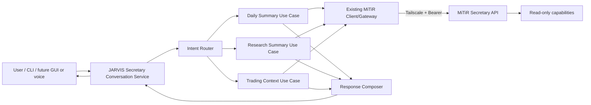

# Phase 3 Architecture — Conversational Specialist Read Integration

## 1. Intent

Phase 3 adds a JARVIS Secretary orchestration layer above the proven MiTiR integration. It should make Daily, Research, and Trading read capabilities conversational without coupling the user-facing surface to MiTiR transport/task mechanics.

## 2. Target shape

Responsibilities are mandatory; exact module/class names are not. Codex must first inspect the current repository and extend existing boundaries where possible.

## 3. Layer responsibilities

### Conversation entry point

- receives one natural-language request;
- invokes the Secretary conversation service;
- renders one readable response;
- may expose a narrow diagnostic option for non-secret task/correlation metadata;
- knows nothing about Bearer headers, polling loops, raw task JSON, or environment secrets.

### Secretary conversation service

Owns the product-level flow:

1. normalize the incoming message;
2. obtain a routing decision;
3. reject/clarify unsupported or mutating requests;
4. invoke one read-only specialist use case;
5. pass the structured specialist result to a response composer;
6. return a stable `SecretaryResponse`.

The service must not itself implement HTTP or MiTiR task polling.

### Intent router

The router returns a small typed decision, e.g.:

- `daily`
- `research`
- `trading`
- `clarify`
- `unsupported`

A deterministic keyword/rule implementation is acceptable as a fallback/baseline. If an LLM is used, hide it behind an interface such as `IntentInterpreter` so tests can inject a fake. LLM output must be validated against the fixed enum above.

No LLM-produced arbitrary capability ID, URL, method, JSON payload, or executable action may cross the boundary.

### Specialist read use cases

Daily should reuse `DailySummaryService` from Phase 2.

Research and Trading should follow the same application pattern only where it reduces duplication naturally. Prefer small services/functions such as:

- `ResearchSummaryService.get_summary()`
- `TradingContextService.get_context(limit=5)`

Each service owns MiTiR task composition, bounded polling, result mapping, and stable JARVIS failure categories. Shared polling/task execution may be extracted only after duplicate behavior is demonstrated.

### Result models

Expose JARVIS-owned typed models. Avoid one giant generic dict.

Suggested responsibilities:

- `DailySummaryResult` — retain existing Phase 2 contract;
- `ResearchSummaryResult` — bounded summary/status/items/references actually returned;
- `TradingContextResult` — bounded mode/status/activity/portfolio-risk fields actually returned;
- `SecretaryResponse` — display text, selected domain, optional reporting timestamp, and safe diagnostic metadata.

Result mappers must tolerate optional fields and must never invent missing content.

### Response composer

The composer converts typed result models into a concise Secretary-style answer.

Two acceptable implementations:

1. deterministic presenter/template; or
2. optional LLM-backed phrasing over a strictly bounded structured result.

If an LLM is used, the structured MiTiR result remains the source of truth. The prompt must explicitly prohibit adding unsupported facts. Tests must not require the external LLM.

## 4. Read-only safety boundary

Phase 3 exposes only:

- `daily.summary` + `{}`
- `research.summary` + `{}`
- `trading.context` + bounded `{limit}`

Mutating user requests must not be reinterpreted as successful actions. The response should state that the current phase is read-only and, where useful, offer to show the current related status/context instead.

MiTiR remains authoritative for its own safety boundaries.

## 5. Runtime configuration

Continue to use:

- `MITIR_BASE_URL`
- `MITIR_INTEGRATION_TOKEN`

If an external LLM is introduced, use an existing repository/provider configuration when available. Do not add a second secret-loading approach merely for Phase 3.

Core routing, mapping, and presentation must be dependency-injected/testable without environment access.

## 6. Failure model

Preserve the stable Phase 2 transport/application categories and add conversational categories:

- `ambiguous_intent`
- `unsupported_intent`
- `read_only_boundary`

The user-facing layer receives safe messages, not raw exceptions. Diagnostic metadata may include domain, task ID, correlation ID, and terminal state, never secret values.

## 7. Testing architecture

Use fakes at three boundaries:

- fake intent interpreter/router decision;
- fake specialist services or fake MiTiR client;
- fake response composer/LLM when applicable.

Tests should distinguish:

- routing correctness;
- one-and-only-one capability invocation;
- no call on unsupported/ambiguous/mutating input;
- result mapping/no fabrication;
- safe user-facing error rendering;
- regression of Phase 2 Daily Summary.

Live acceptance is separate and opt-in from Windows.

## 8. Change discipline

- Inspect current code before creating folders or abstractions.
- Keep Phase 2 Daily Summary API/CLI working.
- Prefer extending current modules over creating parallel frameworks.
- Do not modify MiTiR source for JARVIS convenience.
- If real MiTiR output reveals a contract defect, stop, record evidence, and use the formal handoff before changing either side.
- Do not add mutating tools in Phase 3.
