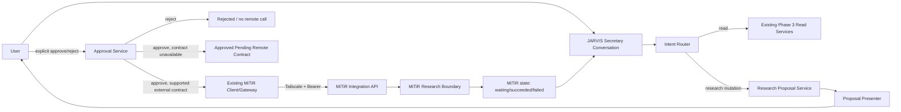

# Phase 4 Architecture — Human-Approved Research Mutation

## 1. Intent

Phase 4 adds a controlled mutation path without weakening the read-only architecture that was verified in Phase 3.

The architectural rule is simple: **conversation may propose; only explicit human approval may authorize JARVIS to attempt a Research mutation; only a published MiTiR external contract may carry that mutation across the process boundary.**

## 2. Target shape



## 3. Responsibility boundaries

### Secretary conversation

Owns natural-language interaction and user-facing continuity. It must not call a mutation transport directly. It may:

- identify Research mutation intent;
- request clarification;
- ask Proposal Service to create a proposal;
- route an explicit later approve/reject message to Approval Service;
- present safe state/result information.

### Research Proposal Service

Owns proposal construction from a normalized mutation intent. It must not perform remote work.

It should produce a stable proposal object with:

- unique non-secret ID;
- action type;
- bounded parameters;
- target/topic/reference;
- human-readable effect summary;
- state and timestamps.

### Proposal Store

Use the smallest storage approach consistent with the repository. For the first increment, in-memory/application-lifetime storage is acceptable if the current CLI/session architecture is stateless and the limitations are explicit. If an existing local persistence abstraction exists, reuse it rather than adding a new database.

The store must support:

- exactly identifiable pending proposals;
- transition validation;
- rejection/expiry;
- lookup for an explicit approval command.

### Approval Service

Owns approval/rejection transition rules. It must:

- require an explicit proposal identity or exactly-one-pending-proposal context;
- prevent duplicate or stale approval from producing duplicate submission;
- never interpret proposal creation as approval;
- stop at `approved_pending_remote_contract` while no supported MiTiR mutation capability exists.

### MiTiR Gateway

Reuse existing typed `MiTiRClient` and task lifecycle once a formal mutation capability is published. Do not add raw `urllib`, `requests`, or internal `/api/research/action` calls for convenience.

Any new remote mutation adapter must depend on synchronized OpenAPI/typed models and preserve:

- Bearer authentication;
- idempotency key;
- correlation ID;
- bounded polling;
- structured errors;
- `waiting_for_approval` if emitted by MiTiR.

## 4. Contract evolution

The current v0.1.0 integration contract is read-only at the capability level. Therefore Phase 4 remote execution is contract-first.

Expected coordination sequence:

1. JARVIS records the desired bounded Research mutation use case in MiTiR `docs/from-Jarvis.md`.
2. MiTiR accepts/rejects/adjusts it in MiTiR SDD.
3. MiTiR publishes the exact external capability ID, input/output schema, approval semantics, and OpenAPI update.
4. JARVIS syncs the new OpenAPI and adds/updates consumer contract tests.
5. Only then does JARVIS implement remote submission.

The architecture does **not** prescribe the final MiTiR capability name. A name such as `research.execute` is illustrative only until MiTiR owns and publishes it.

## 5. State model

Recommended JARVIS-side transitions:

```text
proposed -> rejected
proposed -> expired
proposed -> approved
approved -> approved_pending_remote_contract
approved -> submitted             # only when supported contract exists
submitted -> waiting_for_approval # if MiTiR requires another approval
submitted -> succeeded
submitted -> failed
waiting_for_approval -> succeeded/cancelled/failed only through supported MiTiR semantics
```

No transition may go from `proposed` directly to `submitted` without an explicit approval event.

A second identical approve event must not create a second remote task. Reuse/derive idempotency from the proposal identity plus submission attempt according to the final contract.

## 6. Safety invariants

The implementation must preserve all of these invariants:

1. No remote mutation on the proposal-creation turn.
2. No remote mutation after reject/expiry.
3. No internal MiTiR endpoint bypass.
4. No auto-approval of MiTiR `waiting_for_approval`.
5. No Trading mutation code path in Phase 4.
6. No secret-bearing proposal/evidence records.
7. No raw task JSON in normal conversation.
8. No fallback from unavailable contract to an undocumented request.

## 7. Testing architecture

Use fake proposal store, fake clock where useful, and fake MiTiR gateway. Tests must separately verify:

- routing;
- proposal content;
- state transition rules;
- approve/reject behavior;
- no remote call before approval;
- no remote call when contract unavailable;
- idempotent approval/submission behavior;
- MiTiR waiting-for-approval presentation;
- failure mapping;
- no secret leakage.

The Windows live mutation test is opt-in and cannot run until the MiTiR external mutation contract is accepted and available.

## 8. Migration discipline

Phase 3 read-only behavior remains the baseline. Do not rewrite working Daily/Research/Trading read services merely to fit the new proposal model. Add the mutation path beside the existing read path and share only proven reusable abstractions.
