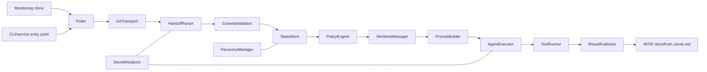

# Phase 5 Architecture — Git Handoff Automation

## Boundaries and components

Shared protocol logic is separate from JARVIS configuration, Windows scheduling, Git transport, Codex execution, and application implementation; it does not couple to the MiTiR API client.

| Component | Responsibility |
| --- | --- |
| Poller / GitTransport | Fetch monitoring clone, compare remote SHA, read pinned handoff, append only outbound document. |
| HandoffParser / SchemaValidator | Extract YAML and enforce Protocol v1.0.0/type allowlists. |
| StateStore / RecoveryManager | SQLite idempotency, locks, attempts, recovery, stale locks, redacted evidence. |
| PolicyEngine | Enforce execution level, approval, prohibited actions, hops, kill switch, ownership. |
| WorktreeManager | Isolated branches/worktrees and retention without touching developer work. |
| PromptBuilder / AgentExecutor | Fixed prompt, fake interface then bounded non-interactive Codex adapter, timeout/result capture. |
| TestRunner / ResultPublisher | Required tests and correlated redacted status/result/error append. |
| SecretRedactor / CLI | Redaction everywhere; health/status/dry-run/one-shot/daemon/shutdown. |

## Receive-to-response sequence

1. Poller fetches; unchanged `origin/main` exits before parsing.
2. Transport reads the designated handoff document at the fetched SHA.
3. Parser, validator, redactor, and policy reject invalid/expired/misaddressed/hash-mismatched input before any worktree or agent.
4. State store atomically detects replay, conflict, or active execution and records acceptance.
5. L0–L2 only: create task worktree/branch, build fixed prompt, run bounded agent, and execute required tests.
6. Publisher appends a new correlated redacted response when policy permits; store final state.
7. Restart invokes recovery first. Conflict, low disk, stale unsafe state, or approval boundary publishes blocked/approval-required, never auto-repairs.

L3 push and every L4 action are denied initially. Windows Task Scheduler starts daemon mode under the intended account; configuration contains only roots, bounds, retention, and kill-switch state—not secrets.
